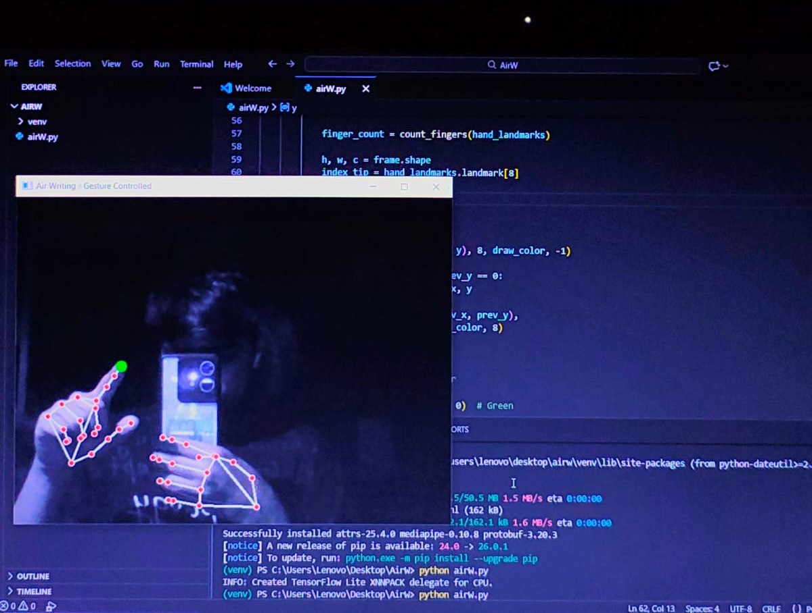

# Air Writing System

A real-time gesture-controlled air writing system built using Python, OpenCV, and MediaPipe.

## Demo Output

## Features
- Draw in air using hand gestures
- Real-time hand tracking
- Gesture-based controls
- Clear screen using open palm
- Built using Computer Vision

## Technologies Used
- Python
- OpenCV
- MediaPipe
- NumPy